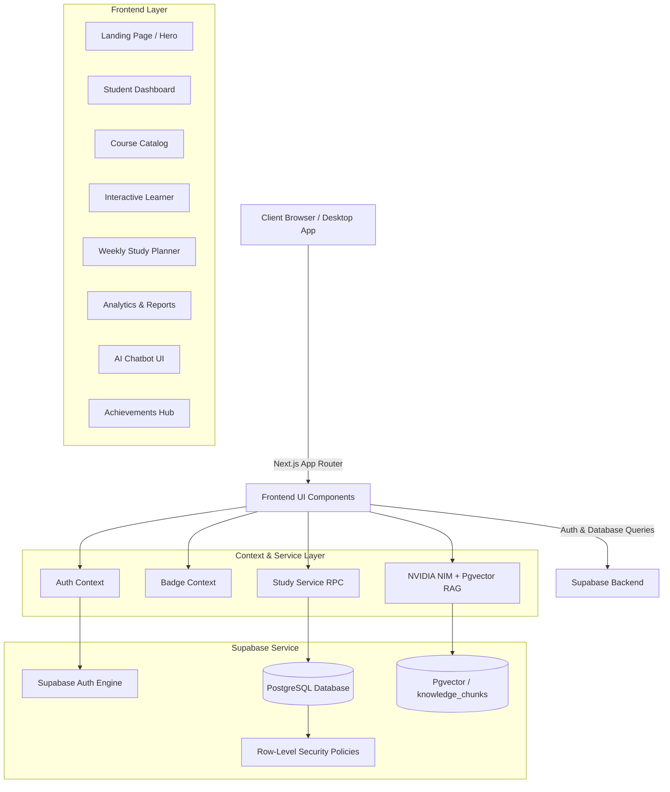
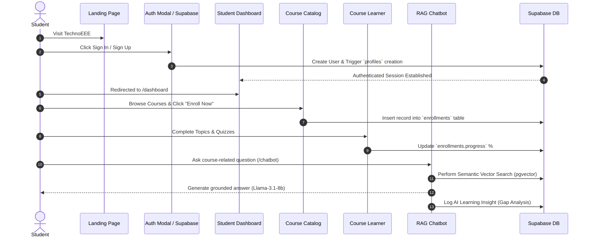

# 🎓 TechnoEEE — End-to-End Academic Learning Platform & AI Assistant

> **TechnoEEE** is a student-focused, university-grade online learning management platform built with Next.js 16, Supabase, NVIDIA NIM, and custom CSS design systems. It enables computer science and engineering students to explore structured curricula, follow interactive lesson roadmaps, track real-time study analytics, schedule weekly study routines, and get personalized help from an embedded RAG-powered AI Academic Assistant.

---

## 📋 Table of Contents
1. [Executive Summary](#-executive-summary)
2. [End-to-End System Architecture & Workflow](#-end-to-end-system-architecture--workflow)
3. [Complete Feature Breakdown & Implemented Modules](#-complete-feature-breakdown--implemented-modules)
4. [Design System & Visual Standards](#-design-system--visual-standards)
5. [Database Schema & Backend Services](#-database-schema--backend-services)
6. [Project Folder & File Map](#-project-folder--file-map)
7. [Installation & Setup Guide](#-installation--setup-guide)
8. [Deployment Strategy](#-deployment-strategy)
9. [Feature Implementation Verification Matrix](#-feature-implementation-verification-matrix)

---

## 🎯 Executive Summary

### What is TechnoEEE?
TechnoEEE bridges the gap between traditional academic coursework and modern self-paced learning tools. Built specifically for technical fields (Computer Science, Artificial Intelligence, Machine Learning, DBMS, Algorithms, and Electronics), TechnoEEE organizes university subjects into digestible modules, interactive roadmaps, video lessons, notes, and topic quizzes. 

It now features a **Semantic Retrieval-Augmented Generation (RAG) AI Chatbot**, acting as an on-demand tutor that grounds its answers strictly in the course material.

### Target Audience
- **Undergraduate & Postgraduate Technical Students:** Seeking structured revision, roadmap tracking, and self-paced course exploration.
- **Instructors & Self-Learners:** Looking for organized course roadmaps and study planning tools.

### Core Value Propositions
- **Structured Roadmap Learner:** Replaces unstructured videos with a split-screen roadmap timeline.
- **Data-Driven Progress Tracking:** Instant visibility into completed modules, weekly streaks, and study hours.
- **Context-Aware AI Tutor:** A state-of-the-art AI chatbot utilizing Supabase `pgvector` and NVIDIA NIM (`Llama-3.1-8b`) for semantic search across course materials.
- **AI Learning Insights:** Automatic gap-analysis based on student-chatbot interactions, highlighting confusing topics on the analytics dashboard.
- **Gamified Milestone Recognition:** Rule-based badge engine rewarding consistency and course completions.
- **Strict Professional Aesthetics:** Built with a curated dark-slate/indigo palette, smooth Lenis scrolling, fluid CSS scaling (`clamp()`, `vw`), and zero emojis (100% SVG vectors).

---

## 🏗️ End-to-End System Architecture & Workflow

### 1. High-Level Architecture


### 2. End-to-End User Journey Flow


---

## 💻 Complete Feature Breakdown & Implemented Modules

### 1. 🌐 Landing Page & Public Portal (`/`)
- **Interactive Dev Mode Hero:** Toggle between production showcase mode and technical developer mode.
- **Wide Course Grid:** Displaying top subjects scaled dynamically to 92vw (max 1440px) to eliminate display white space.
- **Academic FAQ Accordion:** Interactive, accessible Q&A accordion featuring custom questions specific to TechnoEEE.

### 2. 🔐 Authentication Engine (`/components/auth/AuthModal.js`)
- **Supabase Auth Integration:** Email and password sign-up/sign-in flows.
- **Auto Profile Generator:** PostgreSQL database trigger `on_auth_user_created` automatically inserts a row into `public.profiles`.

### 3. 📊 Student Dashboard (`/dashboard`)
- **Dynamic Welcome Banner:** Displays logged-in student name and quick-action buttons.
- **Metric Cards:** Courses in Progress, Completed Topics, Total Hours Spent, Current Streak.
- **Up Next Widget:** Pinned card indicating the current lesson in progress with a direct "Resume Next Lecture" CTA.

### 4. 📚 Course Catalog & Hub (`/courses`, `/my-courses`)
- **Filterable Subject Browser:** Search by course code or subject title.
- **One-Click Enrollment:** Instant enrollment write-back to Supabase `enrollments` table.
- **Visual Progress Meters:** Live completion bar per course (0% – 100%).

### 5. 🧩 Interactive Course Learner (`/learn/[courseId]`)
- **Split-Screen Layout:** Vertical timeline with interactive nodes (left) and content workspace for Videos, Notes, and Quizzes (right).
- **Badge Engine Integration:** Automatically calculates course completion (100%) and unlocks the course badge for immediate claiming.

### 6. 📅 Weekly Study Planner (`/planner`)
- **Weekly Schedule Grid:** Organize study sessions across Monday through Sunday.
- **Built-in Pomodoro Focus Timer:** 25-minute focus session timer with start/pause/reset controls.

### 7. 🤖 AI Academic Assistant & Semantic RAG (`/chatbot`)
- **Semantic Vector Search:** Integrates Supabase `pgvector` to store and retrieve course content chunks via cosine similarity.
- **NVIDIA NIM LLM Engine:** Powered by NVIDIA's `nv-embedqa-e5-v5` for embeddings and `meta/llama-3.1-8b-instruct` for fast, grounded generation.
- **Source Attribution:** Dynamically renders clickable source badges showing exactly which course module the answer came from.
- **Topic Fallback:** Implements a hybrid search (Vector Semantic Search falling back to TF-IDF if the vector store is uninitialized).

### 8. 📈 Analytics, Reports, & AI Insights (`/reports`)
- **Chart.js Visualizations:** Bar and line charts displaying hours studied per day/week, and a skill focus radar.
- **AI Learning Insights Panel:** A dedicated section that analyzes all student-chatbot interactions to reveal:
  - **Most Queried Topics:** (e.g., "Von Neumann bottleneck", "SIMD").
  - **Learning Gap Types:** (e.g., *Concept Confusion*, *Needs Example*, *Needs Explanation*).
  - Helps students (and eventually faculty) pinpoint exactly where the learning struggles lie.

### 9. 🏅 Achievements & Badges (`/achievements`)
- **Interactive Claim Modal:** Confetti-style victory modal when claiming earned badges.
- **Notification Engine:** Real-time header bell with unread badge count and swipe-to-dismiss functionality.

---

## 🎨 Design System & Visual Standards

### Color Palette
| Token | Hex Value | Usage |
|-------|-----------|-------|
| Dark Slate Background | `#0f172a` / `#1e293b` | Primary dark cards, welcome banners, hero sections |
| Primary Blue | `#1352f1` / `#3a8aff` | Primary CTAs, active sidebar item, active tags |
| Accent Teal / Cyan | `#26d0ce` | Gradients, progress accents |
| Page Background | `#f4f7fb` | Main application background |
| Text Primary | `#0f172a` / `#f8fafc` | Headings, card titles (light/dark mode variants) |
| Text Secondary | `#64748b` / `#cbd5e1` | Subtitles, secondary metrics |

### Zero-Emoji Policy
To maintain corporate-grade professionalism, **all emojis have been removed** from the entire application and replaced with custom, vector-based inline SVG icons or `lucide-react` SVG components (e.g., Target, Shield, BookOpen, BotMessageSquare).

---

## 🗄️ Database Schema & Backend Services

### PostgreSQL Tables (Supabase)

```sql
-- Core Tables
CREATE TABLE public.profiles (...);
CREATE TABLE public.enrollments (...);
CREATE TABLE public.modules_progress (...);

-- AI RAG & Insights Tables
CREATE TABLE public.knowledge_chunks (
  id uuid DEFAULT gen_random_uuid() PRIMARY KEY,
  chunk_id text UNIQUE NOT NULL,
  course_code text NOT NULL,
  topic_name text NOT NULL,
  chunk_text text NOT NULL,
  embedding vector(1024),          -- pgvector extension
  created_at timestamptz DEFAULT now()
);

CREATE TABLE public.ai_learning_insights (
  id uuid DEFAULT gen_random_uuid() PRIMARY KEY,
  user_id uuid REFERENCES auth.users ON DELETE CASCADE,
  course_code text,
  topic_name text,
  insight_type text,               -- e.g., 'concept_confusion'
  summary text,
  created_at timestamptz DEFAULT now()
);
```

### Supabase RPCs (Stored Procedures)
- `match_knowledge_chunks`: Performs fast cosine similarity search across `vector(1024)` embeddings to power the Chatbot RAG pipeline.

---

## 📁 Project Folder & File Map

```
Technoeee/
├── app/
│   ├── page.js                  # Landing page (Dev mode hero, course explorer, FAQ)
│   ├── globals.css              # Custom CSS design system, dark-blue themes, cards
│   ├── dashboard/page.js        # Student Dashboard (Stats, Active Courses)
│   ├── courses/page.js          # Course Catalog with filterable search & enrollment
│   ├── learn/[courseId]/page.js # Split-screen course learner with timeline roadmap
│   ├── reports/page.js          # Analytics, Chart.js visualizer & AI Insights
│   ├── chatbot/page.js          # AI Academic Assistant UI
│   ├── api/chat/rag/route.js    # AI Chatbot RAG API (NVIDIA NIM)
│   └── api/chat/insights/route.js # AI Learning Insights logger API
├── components/
│   ├── layout/                  # Navbar, Sidebar, DashboardHeader
│   ├── auth/                    # AuthModal
│   └── shared/                  # PomodoroTimer, VideoPlayer, NotificationDropdown
├── lib/
│   ├── supabase/client.js       # Supabase client instance
│   ├── context/                 # auth-context.js, badge-context.js
│   ├── services/studyService.js # RPC & analytics data service
│   └── rag/                     # vectorSearch.js (pgvector logic), contentIndex.js
├── scripts/
│   └── ingestEmbeddings.js      # CLI tool to batch-embed JSON course notes to Supabase
├── public/
│   ├── data/real_courses_data.json # Master course catalog & topics repository
│   └── image/                   # Logos, static banners, icons
└── README.md                    # Project report & documentation
```

---

## 🛠️ Installation & Setup Guide

### 1. Prerequisites
- **Node.js:** v18.0.0 or higher
- **Supabase Account:** Free project at [supabase.com](https://supabase.com)
- **NVIDIA Developer Account:** Free NIM API key at [build.nvidia.com](https://build.nvidia.com)

### 2. Local Environment Setup

```bash
git clone https://github.com/Debjanimandal/Technoeee.git
cd Technoeee
npm install
```

### 3. Environment Variables Configuration
Create a `.env.local` file in the root directory:

```env
NEXT_PUBLIC_SUPABASE_URL=https://your-supabase-project.supabase.co
NEXT_PUBLIC_SUPABASE_ANON_KEY=your-supabase-anon-key
NVIDIA_API_KEY=nvapi-your-nvidia-nim-key
```

### 4. Database Setup & RAG Ingestion
1. Run the SQL scripts found in your Supabase SQL Editor to create tables (including `pgvector` setup).
2. To enable Semantic Search, run the ingestion script locally to embed your course notes:
```bash
node scripts/ingestEmbeddings.js
```

### 5. Running Development Server
```bash
npm run dev
```
Open [http://localhost:3000](http://localhost:3000).

---

## 🚀 Deployment Strategy

This project is optimized for deployment on **Vercel**:

1. Push your changes to GitHub.
2. Link your GitHub repository to [Vercel](https://vercel.com).
3. Set environment variables `NEXT_PUBLIC_SUPABASE_URL`, `NEXT_PUBLIC_SUPABASE_ANON_KEY`, and `NVIDIA_API_KEY` in Vercel project settings.
4. Trigger deployment — Vercel builds the Next.js application automatically.

---

## ✅ Feature Implementation Verification Matrix

| Requirement / Request | Implementation Status | Location in Codebase |
|-----------------------|-----------------------|----------------------|
| **Supabase Auth & Auto-Profile** | ✅ Completed | `auth-context.js`, `AuthModal.js` |
| **Responsive Screen Sizing (`clamp()`)** | ✅ Completed | `app/globals.css` |
| **Zero-Emoji Policy (100% SVG)** | ✅ Completed | All UI components |
| **Split-Screen Course Learner** | ✅ Completed | `app/learn/[courseId]/page.js` |
| **Badge Claim & Victory Engine** | ✅ Completed | `badge-context.js`, `BadgeClaimModal.js` |
| **Chart.js Study Analytics** | ✅ Completed | `app/reports/page.js` |
| **RAG AI Chatbot (NVIDIA + Llama 3)** | ✅ Completed | `app/chatbot/page.js`, `api/chat/rag/route.js` |
| **pgvector Semantic Search Integration** | ✅ Completed | `lib/rag/vectorSearch.js`, `scripts/ingestEmbeddings.js` |
| **AI Learning Insights Dashboard** | ✅ Completed | `app/reports/page.js`, `api/chat/insights/route.js` |

---

<div align="center">
  <sub>TechnoEEE — University-Grade Student Learning Platform © 2026</sub>
</div>
