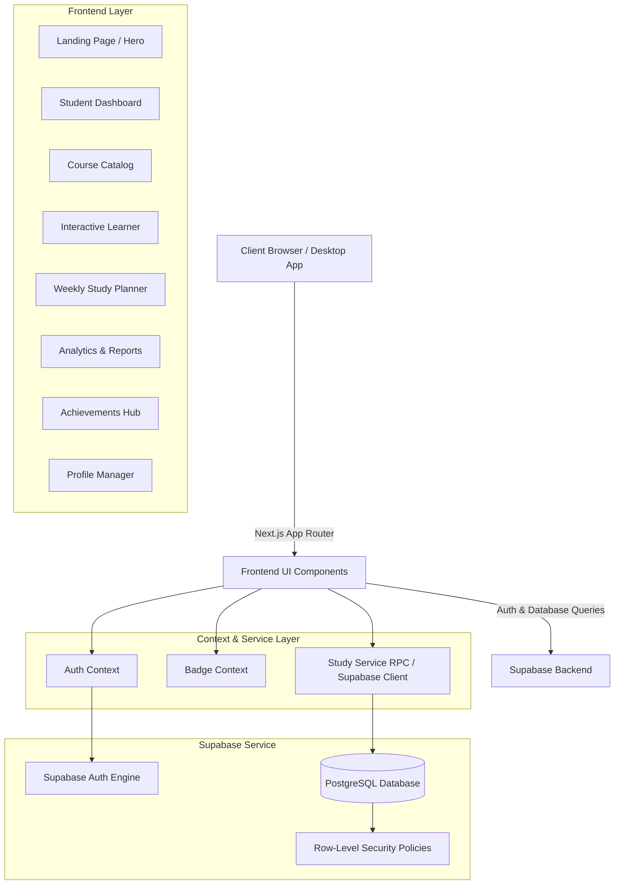
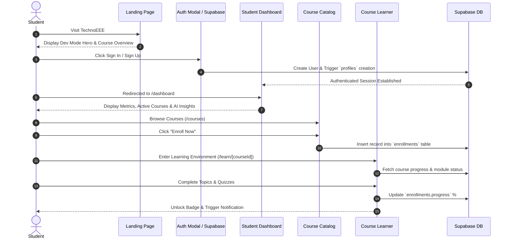

# 🎓 TechnoEEE — End-to-End Academic Learning Platform & Project Report

> **TechnoEEE** is a student-focused, university-grade online learning management platform built with Next.js 16, Supabase, and custom CSS design systems. It enables computer science and engineering students to explore structured curricula, follow interactive lesson roadmaps, track real-time study analytics, schedule weekly study routines, and earn gamified academic achievements — all within a clean, professional, emoji-free interface.

---

## 📋 Table of Contents
1. [Executive Summary](#-executive-summary)
2. [End-to-End System Architecture & Workflow](#-end-to-end-system-architecture--workflow)
3. [Complete Feature Breakdown & Implemented Modules](#-complete-feature-breakdown--implemented-modules)
4. [Design System & Visual Standards](#-design-system--visual-standards)
5. [Database Schema & Backend Services](#-database-schema--backend-services)
6. [Project Folder & File Map](#-project-folder--file-map)
7. [Installation & Setup Guide](#-installation--setup-guide)
8. [Deployment Strategy](#-deployment-strategy)
9. [Feature Implementation Verification Matrix](#-feature-implementation-verification-matrix)

---

## 🎯 Executive Summary

### What is TechnoEEE?
TechnoEEE bridges the gap between traditional academic coursework and modern self-paced learning tools. Built specifically for technical fields (Computer Science, Artificial Intelligence, Machine Learning, DBMS, Algorithms, and Electronics), TechnoEEE organizes university subjects into digestible modules, interactive roadmaps, video lessons, notes, and topic quizzes.

### Target Audience
- **Undergraduate & Postgraduate Technical Students:** Seeking structured revision, roadmap tracking, and self-paced course exploration.
- **Instructors & Self-Learners:** Looking for organized course roadmaps and study planning tools.

### Core Value Propositions
- **Structured Roadmap Learner:** Replaces unstructured videos with a split-screen roadmap timeline.
- **Data-Driven Progress Tracking:** Instant visibility into completed modules, weekly streaks, and study hours.
- **Gamified Milestone Recognition:** Rule-based badge engine rewarding consistency and course completions.
- **Strict Professional Aesthetics:** Built with a curated dark-slate/indigo palette, smooth Lenis scrolling, fluid CSS scaling (`clamp()`, `vw`), and zero emojis (100% SVG vectors).

---

## 🏗️ End-to-End System Architecture & Workflow

### 1. High-Level Architecture


### 2. End-to-End User Journey Flow


---

## 💻 Complete Feature Breakdown & Implemented Modules

### 1. 🌐 Landing Page & Public Portal (`/`)
- **Interactive Dev Mode Hero:** Toggle between production showcase mode and technical developer mode.
- **Wide Course Grid:** Displaying top subjects scaled dynamically to 92vw (max 1440px) to eliminate display white space.
- **Academic FAQ Accordion:** Interactive, accessible Q&A accordion featuring 6 custom questions specific to TechnoEEE.
- **Global Header & Navigation:** Quick search dropdown, courses menu, dev mode toggle, and seamless auth triggering.

### 2. 🔐 Authentication Engine (`/components/auth/AuthModal.js`)
- **Supabase Auth Integration:** Email and password sign-up/sign-in flows.
- **Auto Profile Generator:** PostgreSQL database trigger `on_auth_user_created` automatically inserts a row into `public.profiles` upon account creation.
- **Session Persistence:** Managed via `AuthContext`, handling automatic session revalidation, sign-out, and protected route access.

### 3. 📊 Student Dashboard (`/dashboard`)
- **Dynamic Welcome Banner:** Displays logged-in student name, quick-action buttons for planner and course discovery, and dark-slate gradient styling.
- **Metric Cards:**
  - *Courses in Progress*
  - *Completed Topics*
  - *Total Hours Spent*
  - *Current Streak (Days)*
- **Active Courses Grid:** Visual cards with course thumbnails, course codes, and progress bars.
- **Up Next Widget:** Pinned card indicating the current lesson in progress with a direct "Resume Next Lecture" CTA.
- **AI Insights & Weekly Goal:** Visual feedback widgets highlighting study consistency and remaining weekly target hours.

### 4. 📚 Course Catalog (`/courses`)
- **Filterable Subject Browser:** Search by course code or subject title.
- **Category & Difficulty Pills:** Filter courses by Beginner, Intermediate, or Advanced level.
- **One-Click Enrollment:** Instant enrollment write-back to Supabase `enrollments` table with immediate UI feedback.

### 5. 🎓 Enrolled Courses Hub (`/my-courses`)
- **Personalized Course Dashboard:** Displays all courses currently enrolled by the user.
- **Visual Progress Meters:** Live completion bar per course (0% – 100%).
- **Direct Learner Link:** Clicking any enrolled course opens the split-screen learning environment.

### 6. 🧩 Interactive Course Learner (`/learn/[courseId]`)
- **Split-Screen Layout:**
  - **Left Pane (Roadmap Tree):** Vertical timeline with interactive nodes for modules, topics, mandatory module quizzes, final grand quiz, and badge claim nodes.
  - **Right Pane (Content Player):** Workspace switching between Video Lessons (custom VideoPlayer component), Markdown Notes, and Interactive Quizzes.
- **Badge Engine Integration:** Automatically calculates course completion (100%) and unlocks the course badge for immediate claiming.
- **Clickable Header Logo:** Clicking the top-left TechnoEEE logo instantly routes back to `/dashboard` from any deep learning route.

### 7. 📅 Weekly Study Planner (`/planner`)
- **Weekly Schedule Grid:** Organize study sessions across Monday through Sunday.
- **Built-in Pomodoro Focus Timer:** 25-minute focus session timer with start/pause/reset controls.
- **Task Management:** Add, edit, and check off study topics.

### 8. 📈 Analytics & Performance Reports (`/reports`)
- **Chart.js Visualizations:** Bar and line charts displaying hours studied per day/week.
- **Topic Strength Analysis:** Strengths vs. weak areas breakdown.
- **Affinity Badges:** Dynamic performance labels ("Consistent", "Loved") calculated via `studyService.js`.

### 9. 🤖 AI Academic Assistant (`/chatbot`)
- **Interactive Chat Interface:** Natural language assistant tailored for engineering and computer science subject questions.
- **Suggested Prompts:** Instant topic starters for algorithms, data structures, and system design.

### 10. 🏅 Achievements & Badges (`/achievements`)
- **Badge Catalog:** Pre-defined badge rules (`lib/data/badges.js`) covering course completion, study streaks, and platform milestones.
- **Interactive Claim Modal (`BadgeClaimModal.js`):** Confetti-style victory modal when claiming earned badges.

### 11. 👤 Student Profile & Settings (`/profile`, `EditProfileModal.js`)
- **Profile Customizer:** Change display name, username, bio, and avatar.
- **Profile Completion Tracker:** Percentage indicator tracking profile completeness.

### 12. 🔔 Notification Engine (`NotificationDropdown.js`)
- **Real-Time Notification Bell:** Header notification icon with live unread badge count.
- **Swipe-to-Dismiss:** Touch and mouse swipe gestures for dismissing alerts.
- **Category Filter:** Color-coded SVG icons for warning, revision, badge claim, and general alerts.

---

## 🎨 Design System & Visual Standards

### Color Palette
| Token | Hex Value | Usage |
|-------|-----------|-------|
| Dark Slate Background | `#0f172a` / `#1e293b` | Primary dark cards, welcome banners, hero sections |
| Primary Blue | `#1352f1` / `#3a8aff` | Primary CTAs, active sidebar item, active tags |
| Accent Teal / Cyan | `#26d0ce` | Gradients, progress accents |
| Page Background | `#f4f7fb` | Main application background |
| Text Primary | `#0f172a` / `#1a1a1a` | Headings, card titles |
| Text Secondary | `#64748b` / `#555555` | Subtitles, secondary metrics |

### Typography & Sizing
- **Font Family:** `Poppins`, sans-serif (imported via `next/font/google`).
- **Responsive Sizing:** Utilizes fluid viewport calculations (`clamp()`, `vw`) so layouts fit properly across screen dimensions without overflow or truncation.

### Zero-Emoji Policy
To maintain corporate-grade professionalism, **all emojis have been removed** from the entire application and replaced with custom, vector-based inline SVG icons or `lucide-react` SVG components:
- 🔥 Difficulty → Flame SVG Icon
- 💼 Relevance → Briefcase SVG Icon
- 🎯 Course Outcomes → Target SVG Icon
- 📝 Quizzes → Quiz/Pen SVG Icon
- 📚 Module Intro → Book SVG Icon
- 🏆 Badges → Trophy SVG Icon
- 📧 Email Alert → Mail SVG Icon

---

## 🗄️ Database Schema & Backend Services

### PostgreSQL Tables (Supabase)

```sql
-- 1. Profiles Table
CREATE TABLE public.profiles (
  id UUID REFERENCES auth.users ON DELETE CASCADE PRIMARY KEY,
  username TEXT UNIQUE NOT NULL,
  full_name TEXT,
  avatar_url TEXT,
  created_at TIMESTAMP WITH TIME ZONE DEFAULT timezone('utc', NOW())
);

-- 2. Enrollments Table
CREATE TABLE public.enrollments (
  id UUID DEFAULT gen_random_uuid() PRIMARY KEY,
  user_id UUID REFERENCES auth.users ON DELETE CASCADE NOT NULL,
  course_title TEXT NOT NULL,
  course_id TEXT,
  category TEXT,
  progress INTEGER DEFAULT 0,
  status TEXT DEFAULT 'Ongoing',
  created_at TIMESTAMP WITH TIME ZONE DEFAULT timezone('utc', NOW())
);

-- 3. Modules Progress Table
CREATE TABLE public.modules_progress (
  id UUID DEFAULT gen_random_uuid() PRIMARY KEY,
  user_id UUID REFERENCES auth.users ON DELETE CASCADE NOT NULL,
  enrollment_id UUID REFERENCES enrollments ON DELETE CASCADE NOT NULL,
  module_name TEXT NOT NULL,
  progress INTEGER DEFAULT 0
);
```

### Row Level Security (RLS)
- `profiles`: SELECT, UPDATE, INSERT enabled for authenticated `auth.uid() = id`.
- `enrollments`: ALL operations enabled for `auth.uid() = user_id`.
- `modules_progress`: ALL operations enabled for `auth.uid() = user_id`.

---

## 📁 Project Folder & File Map

```
Technoeee/
├── app/
│   ├── page.js                  # Landing page (Dev mode hero, course explorer, FAQ)
│   ├── globals.css              # Custom CSS design system, dark-blue themes, cards
│   ├── layout.js                # Root layout with Auth & Badge Providers
│   ├── dashboard/page.js        # Student Dashboard (Stats, Active Courses, AI Insights)
│   ├── courses/page.js          # Course Catalog with filterable search & enrollment
│   ├── my-courses/page.js       # Enrolled Courses progress manager
│   ├── learn/[courseId]/page.js # Split-screen course learner with timeline roadmap
│   ├── planner/page.js          # Weekly Study Planner & Pomodoro Timer
│   ├── reports/page.js          # Analytics, Chart.js visualizer & Streaks
│   ├── chatbot/page.js          # AI Academic Assistant interface
│   ├── achievements/page.js     # Badges & Milestones Hub
│   └── profile/page.js          # Student Profile settings page
├── components/
│   ├── layout/
│   │   ├── Navbar.js            # Top header for landing & general pages
│   │   ├── Sidebar.js           # Fixed sidebar navigation (no scrollbar)
│   │   ├── DashboardHeader.js   # Inner page header with clickable logo & profile pill
│   │   └── Footer.js            # Landing page footer
│   ├── auth/
│   │   └── AuthModal.js         # Sign Up / Sign In modal
│   ├── profile/
│   │   └── EditProfileModal.js  # Profile edit modal (About Me, Username, Avatar)
│   ├── achievements/
│   │   └── BadgeClaimModal.js   # Gamified badge victory modal
│   └── shared/
│       ├── NotificationDropdown.js # Real-time notification menu
│       ├── PomodoroTimer.js     # 25-minute focus timer
│       ├── ProfileDropdown.js      # Header avatar popup menu
│       └── VideoPlayer.js         # Responsive video lesson container
├── lib/
│   ├── supabase/
│   │   └── client.js            # Supabase client instance
│   ├── context/
│   │   ├── auth-context.js      # Supabase authentication provider context
│   │   └── badge-context.js     # Gamification & badge eligibility context
│   ├── services/
│   │   └── studyService.js      # RPC & analytics data service
│   └── data/
│       └── badges.js            # Badge catalog definitions and check functions
├── public/
│   ├── data/
│   │   └── real_courses_data.json # Master course catalog & topics repository
│   └── image/                   # Logos, static banners, icons
└── README.md                    # Project report & documentation
```

---

## 🛠️ Installation & Setup Guide

### 1. Prerequisites
- **Node.js:** v18.0.0 or higher
- **npm:** v9.0.0 or higher
- **Supabase Account:** Free project at [supabase.com](https://supabase.com)

### 2. Local Environment Setup

```bash
# Clone the repository
git clone https://github.com/Debjanimandal/Technoeee.git

# Enter project directory
cd Technoeee

# Install dependencies
npm install
```

### 3. Environment Variables Configuration
Create a `.env.local` file in the root directory:

```env
NEXT_PUBLIC_SUPABASE_URL=https://your-supabase-project.supabase.co
NEXT_PUBLIC_SUPABASE_ANON_KEY=your-supabase-anon-key
```

### 4. Running Development Server

```bash
npm run dev
```
Open [http://localhost:3000](http://localhost:3000) in your web browser.

---

## 🚀 Deployment Strategy

This project is optimized for deployment on **Vercel**:

1. Push your changes to GitHub:
   ```bash
   git add .
   git commit -m "feat: project updates"
   git push origin main
   ```
2. Link your GitHub repository to [Vercel](https://vercel.com).
3. Set environment variables `NEXT_PUBLIC_SUPABASE_URL` and `NEXT_PUBLIC_SUPABASE_ANON_KEY` in Vercel project settings.
4. Trigger deployment — Vercel builds the Next.js App Router application automatically.

---

## ✅ Feature Implementation Verification Matrix

| Requirement / Request | Implementation Status | Location in Codebase |
|-----------------------|-----------------------|----------------------|
| **Supabase Auth & Auto-Profile** | ✅ Completed | `lib/context/auth-context.js`, `AuthModal.js` |
| **Responsive Screen Sizing (`clamp()`, `vw`)** | ✅ Completed | `app/globals.css`, `ProfileDropdown.js` |
| **Zero-Emoji Policy (100% SVG)** | ✅ Completed | All pages (`app/learn/[courseId]/page.js`, `courses/page.js`) |
| **Clickable Logo to Dashboard** | ✅ Completed | `components/layout/DashboardHeader.js` |
| **Sidebar Scrollbar Removal** | ✅ Completed | `app/globals.css` (`.sidebar { overflow: hidden; }`) |
| **Wide Course Cards Grid (92vw)** | ✅ Completed | `app/globals.css` (`.course-grid`) |
| **Academic FAQ Accordion (6 Qs)** | ✅ Completed | `app/page.js` |
| **Split-Screen Course Learner** | ✅ Completed | `app/learn/[courseId]/page.js` |
| **Badge Claim & Victory Engine** | ✅ Completed | `lib/context/badge-context.js`, `BadgeClaimModal.js` |
| **Weekly Planner & Pomodoro Timer** | ✅ Completed | `app/planner/page.js`, `PomodoroTimer.js` |
| **Chart.js Study Analytics** | ✅ Completed | `app/reports/page.js`, `lib/services/studyService.js` |

---

<div align="center">
  <sub>TechnoEEE — University-Grade Student Learning Platform © 2026</sub>
</div>
